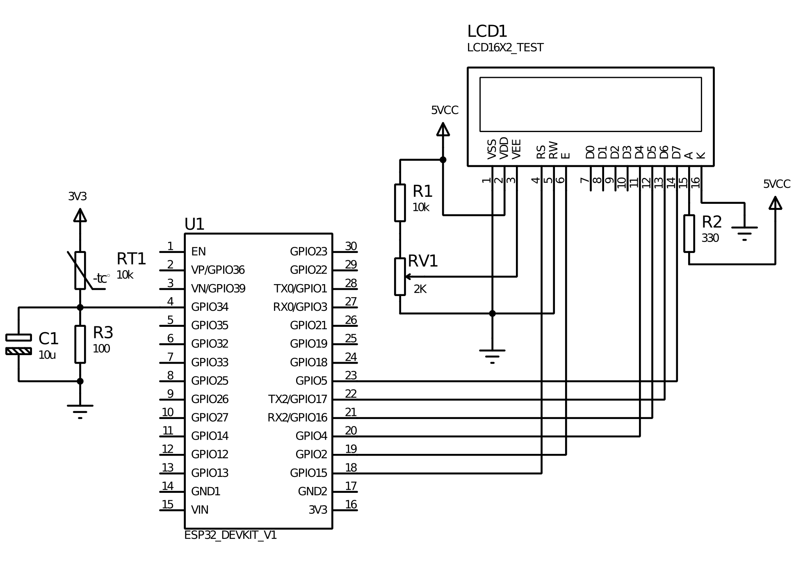
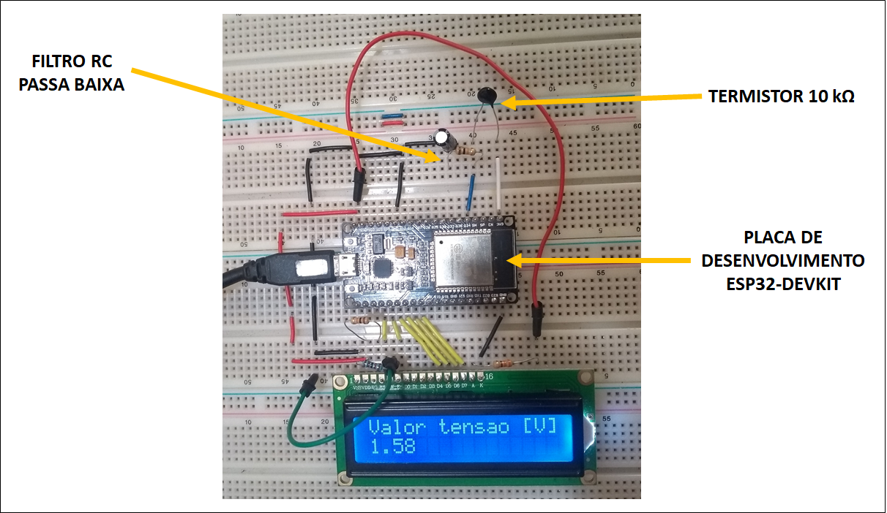

# Utilizando o Termistor (ou LDR)

## Introdução
Neste experimento utilizaremos o termistor para medir temperatura. Primeiramente vamos obter a tensão do circuito e depois converter os valores de tensão para temperatura. 

## Termistores 
Termistores são semicondutores sensíveis a temperaturas, em outras palavras, são resistores de resistência variável, que variam sua resistência em função da temperatura.

Existem dois tipos:

NTC (Negative Temperature Coefficient), que diminui sua resistência com o aumento da temperatura.
PTC (Positive Temperature Coefficient), que aumenta sua resistência com o aumento da temperatura. 

Obs: A maioria dos metais possuem coeficiente positivo de temperatura.

## Código
Códigos auxiliares para o utilização de módulos sensores de diversos
tipos aliados ao microcontrolador ESP32 por meio da placa de
desenvolvimento ESP32-DEVKIT1. Os códigos também são compatíveis
placas Arduino, porém, é necessário revisar a compatibilidade de
funções dos pinos.

* Licença: GNU GPLv3
*
*/

//incluir bibliotecas
#include <LiquidCrystal.h>

//Definição pino termistor
#define ADC_PIN 34

// Definição de pinos para o display 16x2
#define DISPLAY_RS 15
#define DISPLAY_EN 2
#define DISPLAY_D4 4
#define DISPLAY_D5 16
#define DISPLAY_D6 17
#define DISPLAY_D7 5

// Declaração do display lcd (rs, en, d4, d5, d6, d7);
LiquidCrystal display_lcd(DISPLAY_RS, DISPLAY_EN, DISPLAY_D4, DISPLAY_D5, DISPLAY_D6, DISPLAY_D7);

// Declaração variáveis globais
int dt=100; //ms
float t_value = 0.0;
float temp_value = 0.0;
 
// Setup --------------------------------------------------------------------------------------------------
void setup() 
{
  
  //Inicia as comunicações seriais
  Serial.begin(115200);

  //Inicia o display 16x2
  display_lcd.begin(16, 2);
  display_lcd.setCursor(0,0);
  display_lcd.print("Iniciando...");

  //Definição do pino do sensor como input
  pinMode(ADC_PIN, INPUT);
  
  //Delay de inicialização
  delay(2000);

  //Limpa o display 16x2
  display_lcd.clear();
  
}
// end Setup ----------------------------------------------------------------------------------------------

// Main Loop ----------------------------------------------------------------------------------------------
void loop()
{

  // Leitura do pino analógico e conversão para tensão elétrica
  t_value = analogRead(ADC_PIN);
  t_value = (3.3/4095)*t_value; //12 bits de resolução (ESP32)

  temp_value = 37.532*(t_value)-39.006; //Conversão de tensão para temperatura em graus celsius (válido somente para o termistor utilizado no teste)
  
  // Exibir valor no monitor serial do arduino
  Serial.println("Valor de tensão no pino ADC = " + String(t_value,4));
  Serial.println("Temperatura = " + String(temp_value,1));
  
  // Exibir valor no display
  display_lcd.setCursor(0,0);
  display_lcd.print("Valor tensao [V]");
  display_lcd.setCursor(0,1);
  display_lcd.print(String(t_value,4));
  
  // loop delay
  delay(dt);
  
}
## Circuito

