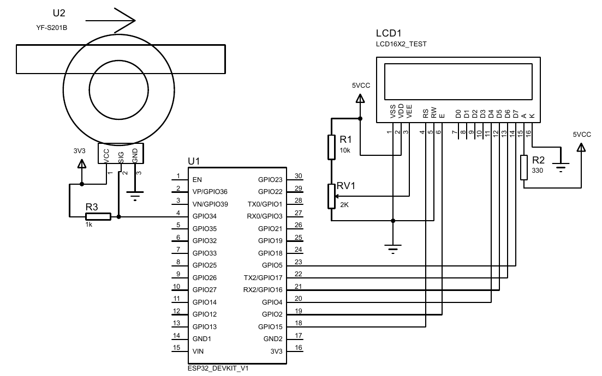
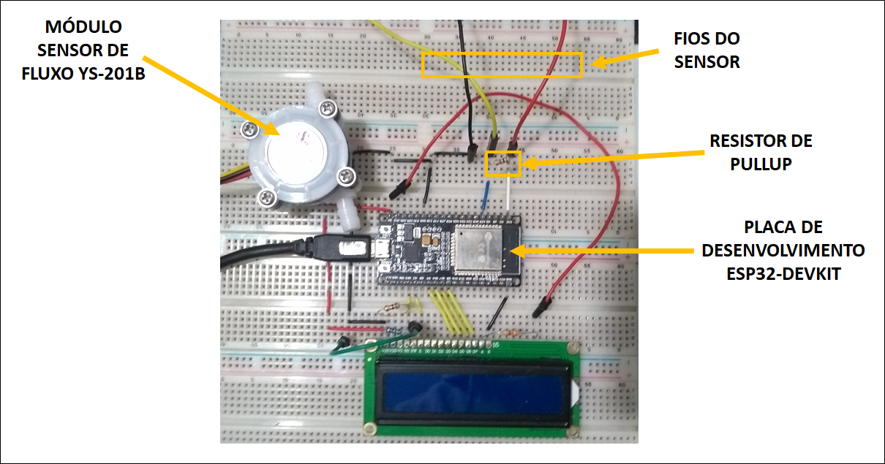

# Utilizando sensor de fluxo de água

## Introdução
Neste experimento será demonstrado a utilização e calibração de um
sensor de fluxo de água usando a plataforma Arduino/ESP32.

## Sensor de fluxo de água

## Circuito




## Funcionamento
### Interrupções
A grande novidade disposta nesse experimento é o uso de interrupções,
cuja finalidade é parar o que o microcontrolador estiver fazendo
para executar uma dada função após a ocorrência de uma alteração
específica de sinal no pino atribuído a tal. O código
utiliza interrupções tanto para alternar entre os modos de calibração
e leitura quanto para realizar medidas com o sensor.

Neste experimento as interrupções para alternância do modo de operação
são acionadas por um botão, enquanto outro é utilizado para determinar
o início e o fim da calibração. Além dos botões, o sensor também
utiliza interrupções para incrementar uma variável contadora de pulsos
(cada pulso causando uma interrupção).

### Modo calibração
A função do modo de calibração é obter um coeficiente de quantidade de
pulsos emitidos pelo sensor por dado volume de água. Para isso, dentro
do modo, é necessário apenas pressionar o botão de calibração e
aguardar que passe o volume de água especificado no código pelo
sensor, para então pressionar novamente o botão. Internamente, o
programa apenas irá contar a quantidade de pulsos e dividir por tal
quantidade predefinida de água.

Após a calibração, o coeficiente é armazenado em uma variável e é
utilizado para a conversão de medida do sensor para unidade de volume
(litro).

### Modo leitura
No modo de leitura, o microcontrolador estará executando um loop onde
habilitará as interrupções provindas do sensor por um intervalo de
tempo, contando a quantidade de pulsos emitidos em tal. Tendo a
quantidade de pulsos por unidade de tempo, é utilizado o coeficiente
obtido na calibração para converter este valor para litros por
segundo. Tendo o valor convertido, este é mostrado no display LCD.


## Código
Iniciamos incluindo a biblioteca para utilização do display LCD.
```ino
#include <LiquidCrystal.h>
```

Em seguida são definidos os pinos utilizados no experimento e instanciado o objeto lcd:
```ino
// Botão para alternar entre o modo de calibração e leitura
#define TOGGLE_MODE_PIN 23

// Botão para iniciar e finalizar a calibração
#define CALIBRATION_PIN 22

// Definição pino do sensor de fluxo
#define SENSOR_PIN 34

// Definição de pinos para o display 16x2
#define LCD_RS 15
#define LCD_EN 2
#define LCD_D4 4
#define LCD_D5 16
#define LCD_D6 17
#define LCD_D7 5

// Instanciação do display lcd (rs, en, d4, d5, d6, d7);
LiquidCrystal lcd(LCD_RS, LCD_EN, LCD_D4, LCD_D5, LCD_D6, LCD_D7);
```

Partindo às variáveis globais, temos as constantes:
```ino
const float volume_calibracao = 0.5;
const int tempo_amostragem = 1000;
```
que são constantes arbitrárias para o volume de água utilizado na
calibração (em litros) e o intervalo de tempo (em milissegundos) que o
microcontrolador irá realizar as medidas do sensor no modo leitura.

As seguintes variáveis são utilizadas para armazenar o valor da vazão
calculada em uma medida e o coeficiente de conversão de medida do
sensor obtido na calibração:
```ino
float vazao;
float coef_sensor;
```

Ainda nas declarações de variáveis globais, temos um novo modificador
de variáveis, o `volatile`. Assim como o `const`, que modifica alguma
propriedade da variável, o `volatile` tem o objetivo de alterar a
maneira com que o compilador e o programa lidará com a variável,
especificando que esta deve ser carregada a partir da memória RAM ao
invés dos registradores de armazenamento. Isso é necessário quando
tais variáveis podem ter seus valores alterados por algo que não é do
controle da sessão de código em que ela se encontra, como acontece no
caso das interrupções.
```ino
volatile int count_pulsos = 0;
volatile bool calibration_mode = false;
volatile bool calibrating = false;
```
A variável `count_pulsos`, como o nome sugere, tem o propósito de
contar a quantidade de pulsos emitidos pelo sensor. Seu valor é
temporário e específico para cada medida.

Já as variáveis `calibrating_mode` e `calibrating` possuem a função de
determinar os diferentes modos e estados do programa. Por serem do
tipo `bool`, elas podem possuir apenas dois valores, `true`ou
`false`. Quando `calibrating_mode` é alterada para `true`, o programa
deve entrar no modo calibração e permanecer neste até que a mesma seja
alterada, assim como no caso em que estiverem sendo feitas as medidas
de calibração do sensor, onde a variável `calibrating` deverá ter o
valor `true`. É importante ressaltar que uma variável determinará o
modo de operação e a outra, caso esteja no modo calibração,
determinará se o programa está no processo de calibração ou não (ou
seja, fazendo leituras do sensor e aguardando que seja pressionado o
botão para o término deste processo).

Na função setup, temos a inicialização do display LCD, declaração dos
modos dos pinos utilizados e o anexo dos pinos às interrupções de
alteração de modo e estado do programa.
```ino
void setup()
{
  // Inicia o display 16x2
  lcd.begin(16, 2);
  lcd.setCursor(0,0);
  lcd.print("Iniciando...");

  // Delay de inicialização
  delay(2000);

  // Limpa o display 16x2
  lcd.clear();

  // Declaração dos modos dos pinos utilizados
  pinMode(TOGGLE_MODE_PIN, INPUT);
  pinMode(CALIBRATION_PIN, INPUT);
  pinMode(SENSOR_PIN, INPUT);

  // Anexa os pinos especificados a uma função de interrupção
  attachInterrupt(digitalPinToInterrupt(TOGGLE_MODE_PIN), toggle_mode, RISING);
  attachInterrupt(digitalPinToInterrupt(CALIBRATION_PIN), calibration, RISING);
}
```

A função `attachInterrupt()` possui como parâmetros o pino que se
deseja anexar à interrupção, a função que deverá ser executada na
interrupção e o modo de funcionamento da interrupção. No nosso caso,
utilizamos o modo `RISING`, que significa que o serviço de interrupção
será executado sempre que o valor nos pinos ir de `LOW` a
`HIGH`. Neste caso, os botões devem conectar a tensão de 3,3 V aos
pinos de interrupção, que deverão estar conectados ao terra (0 V) por
um resistor (pull-down). É importante ressaltar também que os pinos
não são passados diretamente à função, e sim através da função
`digitalPinToInterrupt()` que tem os pinos como parâmetro, isso pois a
função `attachInterrupt()` tem como parâmetro, originalmente, o número
do pino de interrupção, e não o número do pino digital atrelado à este
(cada microcontrolador tem alguns pinos em específico que possuem a
capacidade de serem utilizados para interrupções, que são mapeados
com valores diferentes dos digitais, por mais que sejam exatamente o
mesmo pino).

## Conclusão
