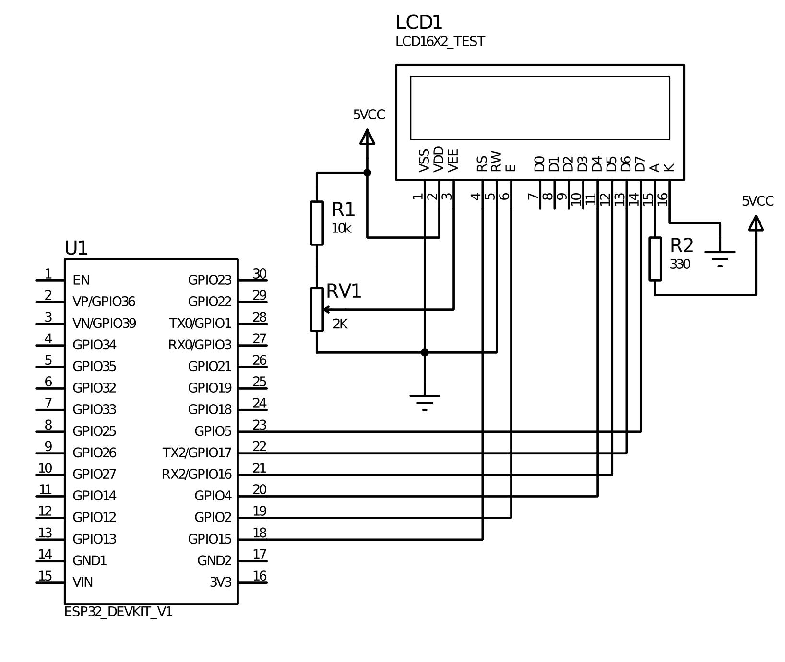
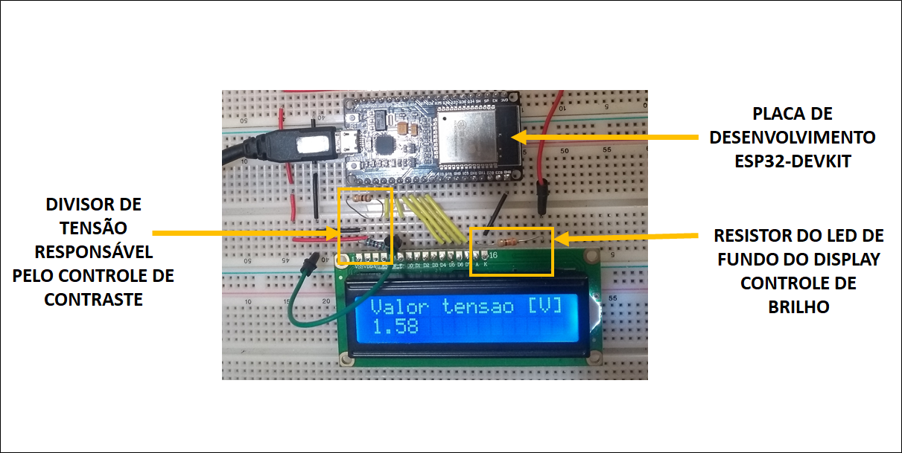

# Utilizando o Display LCD

## Código
Códigos auxiliares para o utilização de módulos sensores de diversos
tipos aliados ao microcontrolador ESP32 por meio da placa de
desenvolvimento ESP32-DEVKIT1. Os códigos também são compatíveis
placas Arduino, porém, é necessário revisar a compatibilidade de
funções dos pinos.

Teste

## Circuito

