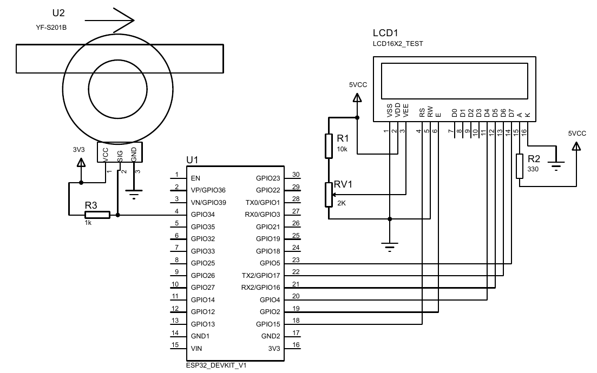
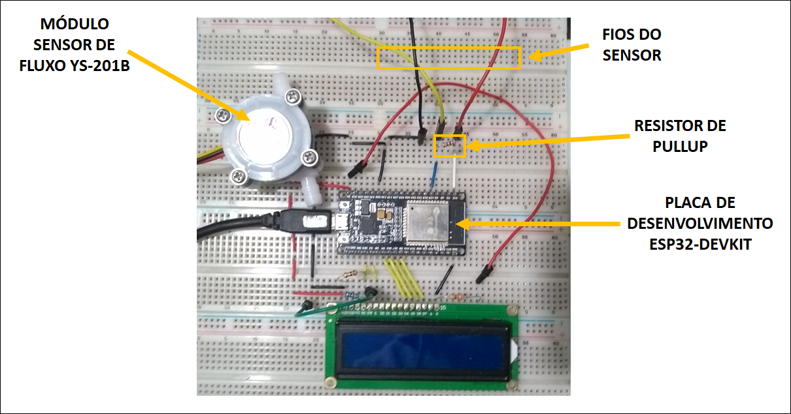

# Utilizando sensor de fluxo de água

## Introdução
Neste experimento iremos demonstrar a utilização e calibração de um
sensor de fluxo de água usando a plataforma Arduino.

## Sensor de fluxo de água
 
## Circuito

## Código

## Conclusão
